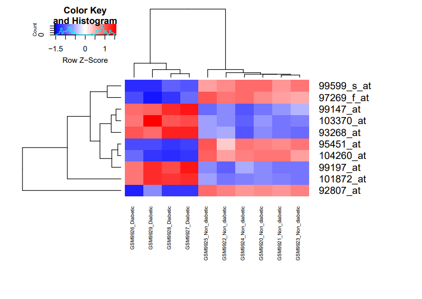

# RNA---seq-Differential-expression-DESeq2
# 🧬 RNA-seq Differential Expression Analysis using DESeq2

## 📌 Objective
This project performs differential gene expression analysis on RNA-seq data to identify genes associated with disease-related biological processes, particularly immune responses.

---

## 🧪 Methods & Tools
- Language: R
- Packages: DESeq2, ggplot2, pheatmap, clusterProfiler
- Techniques:
  - Data normalization
  - Differential expression analysis
  - Visualization (PCA, heatmap, volcano plot)

---

## 🔄 Workflow
1. Data preprocessing and formatting
2. Normalization using DESeq2
3. Differential expression analysis
4. Visualization of results
5. Functional interpretation

---

## 📊 Key Results

- Identified 2806 significant genes
- PCA shows clear separation between diabetic and non-diabetic samples
- KNN classification accuracy: 100%
- Top discriminant genes identified

## 📈 Visualizations

### PCA Plot


### Heatmap


## ⚙️ How to Run

```r
install.packages("BiocManager")
BiocManager::install(c("DESeq2", "pheatmap", "clusterProfiler"))

source("scripts/deseq_analysis.R")
